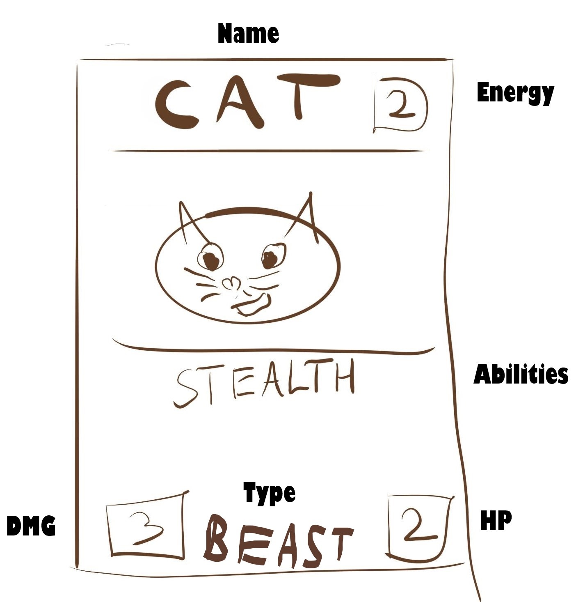

# Mockup

## Map

### Description

- We start our adventure at the starting point and climb further on the map where we can meet

### Details

- Campfire - a place where the main character can rest and regenerate
- Treasure Chest - a place which contains artefacts as well as all kinds of items
- Cursed Altar - a place that can bestow artefacts or items to the hero after the sacrifice
- Monster - A simple battle with monsters
- Elite - Much more challenging battles with monsters after which you can receive artefacts or items
- Shop - a place where we can exchange and buy items and artefacts
- Unknown - an unspecified place can be any type of room

## Battle

### Description

- We start the battle by picking 4 starting cards by swapping or keeping a given card. 
- Obstacles can be generated on the board (minions with attack equal 0 and given life). 
- During the player's turn the player plays cards. 
- At the end of the player's turn all minions attack the opposite field. 
- If the field is empty, the enemy will be attacked. 
- The opponent's turn is the same as the hero's. 
- Combat ends when either the player or the opponent dies.

### Details

- Hero - main character with an indication of current and maximum life
- Energy - a unit to perform activities, at the start of a turn it is reset to its maximum value
- Hand - current card collection
- Potions - a single-use item allowing the performance of actions.
- Minions - 5 fields belong to the player and 5 fields belong to the opponent
- Enemy - the opponent we must defeat

## Minions

### Description

- Cards to be played on the selected field

### Details

- Name - name of the card
- Energy - Energy needed to play the card
- Abilities - Skills and effects of the card
- Hp - Health points of the given card
- DMG - Attack points of the given card
- Type - the family of the specified card type

