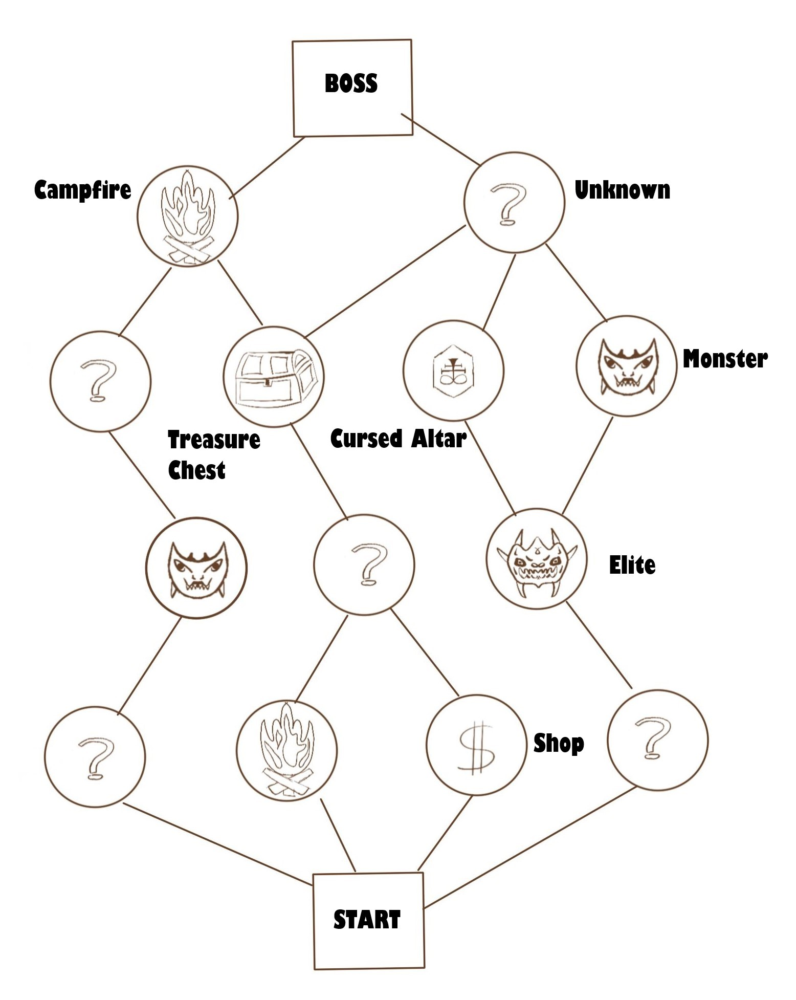
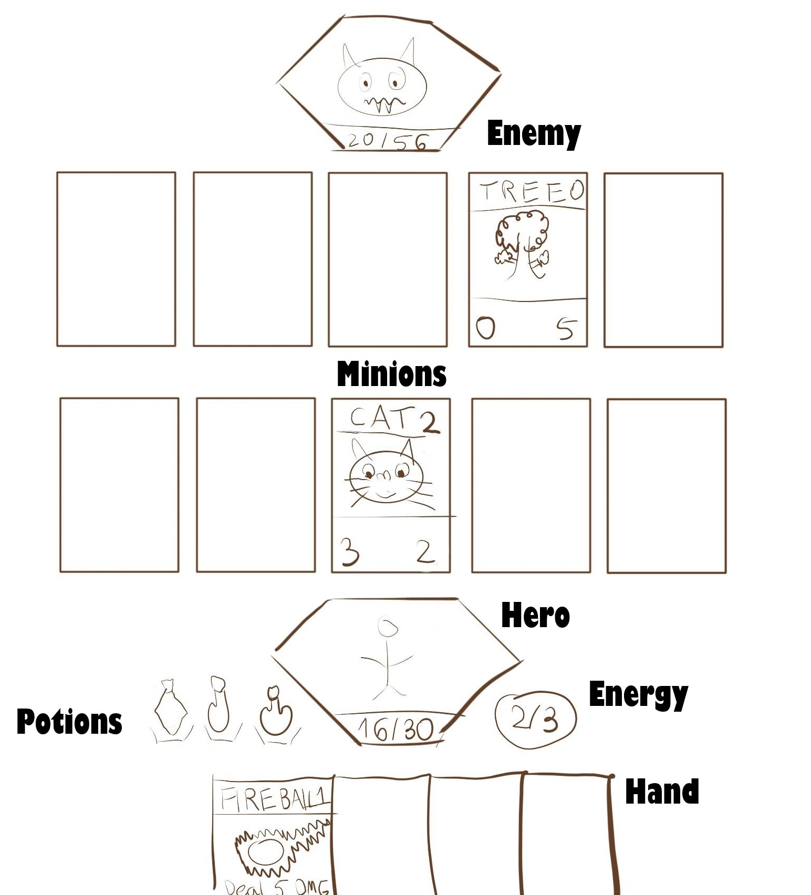

# Mockup

## Map

### Description

We start our adventure at the starting point and climb further on the map where we can meet:
- Campfire - a place where the main character can rest and regenerate
- Treasure Chest - a place which contains artefacts as well as all kinds of items
- Cursed Altar - a place that can bestow artefacts or items to the hero after the sacrifice
- Monster - A simple battle with monsters
- Elite - Much more challenging battles with monsters after which you can receive artefacts or items
- Shop - a place where we can exchange and buy items and artefacts
- Unknown - an unspecified place can be any type of room

## Battle

### Description

- Hero - main character with an indication of current and maximum life
- Energy - a unit to perform activities, at the start of a turn it is reset to its maximum value
- Hand - current card collection
- Potions - a single-use item allowing the performance of actions.
- Minions - cards on the board with life points, attack points, cost of playing, at the start of a turn, they attack the target located on the opposite side in the absence of which they attack the OTHER side
- Enemy - the opponent we must defeat

